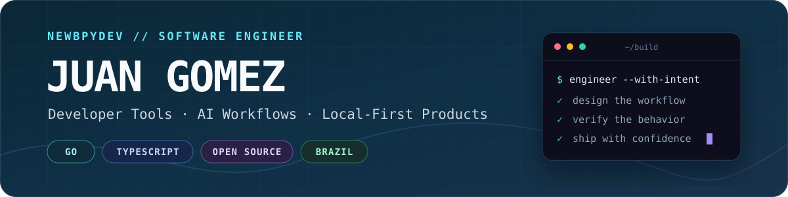

  <picture>
    <source media="(max-width: 600px)" srcset="./assets/profile-hero-mobile.svg" />
    
  </picture>

  
  

## Engineering better ways to build

I build reliable developer tools and AI-assisted workflows that make software delivery safer, faster, and easier to reason about. My work sits where product engineering meets developer experience: terminal applications, coding-agent infrastructure, cross-platform desktop software, and local-first systems.

I'm based in Brazil and work across **English**, **Portuguese**, and **Spanish**.

## What I build

- **Developer tools with a clear point of view** — CLIs, terminal interfaces, Git and GitHub workflows, and automation that turns complex operations into calm, understandable experiences.
- **Agent-native engineering systems** — MCP integrations, portable skills and plugins, structured planning and review workflows, and tooling that gives people and coding agents the same capabilities.
- **Local-first, cross-platform products** — focused desktop and web applications designed around privacy, responsive interaction, and durable user ownership.
- **Delivery infrastructure that earns trust** — reproducible builds, least-privilege automation, transactional updates, rollback paths, and verification that distinguishes local evidence from shipped behavior.

## How I work

I care as much about how software is delivered as what it does.

- Start from the user flow, then shape the architecture around it.
- Use tests, accessibility checks, and browser-level verification as product feedback—not as ceremony at the end.
- Make privacy, failure modes, and recovery paths explicit.
- Prefer simple interfaces backed by strong contracts and clear documentation.
- Build for maintainability, portability, and safe iteration from day one.

## Technology

  
  
  
  
  
  

- **Product interfaces:** React, Next.js, Angular, Vue, Tauri, Electron, Laravel
- **Data and delivery:** PostgreSQL, SQLite, Bun, Vitest, Storybook, GitHub Actions

## Let's build something useful

If you're working on developer experience, AI-assisted products, or dependable cross-platform software, I'd be glad to hear what you're building.

- **Email:** [newbpydev@gmail.com](mailto:newbpydev@gmail.com)
- **LinkedIn:** [linkedin.com/in/juan-gomez-8b05575b](https://www.linkedin.com/in/juan-gomez-8b05575b/)
